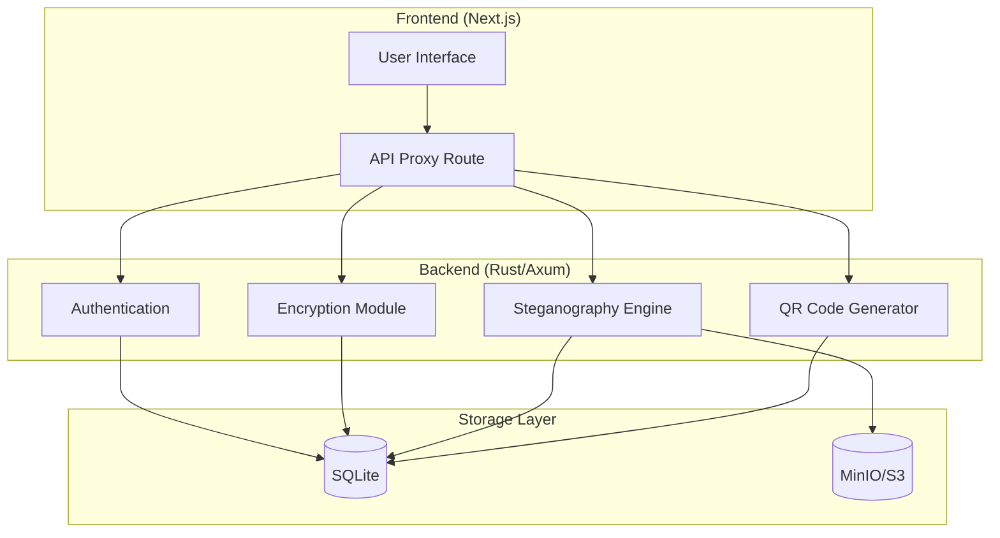

# Stegosaurust - Comprehensive Repository Analysis

**Project Name:** Stegosaurust (SteganoVault)  
**Version:** 0.1.0-beta  
**Built By:** Appsjuragan  
**License:** MIT

---

## 1. Executive Summary

Stegosaurust is a sophisticated **secure steganography platform** that combines military-grade AES-256-GCM encryption with advanced LSB (Least Significant Bit) steganography techniques. The application allows users to hide encrypted messages within images (PNG, JPG, WEBP) while providing a modern, responsive web interface.

The project demonstrates a well-architected full-stack application using **Rust** for the backend and **Next.js** for the frontend, with **SQLite** for metadata storage and **MinIO/S3** for binary storage.

---

## 2. Architecture Overview

### 2.1 System Architecture



### 2.2 Technology Stack

| Component | Technology | Version |
|-----------|------------|---------|
| Backend Framework | Axum | 0.7 |
| Frontend Framework | Next.js | 16.1.1 |
| Database | SQLite | - |
| Object Storage | MinIO/S3 | - |
| Encryption | AES-256-GCM | - |
| Password Hashing | Argon2 | 0.5 |
| Authentication | JWT (HS256) | 9 |
| Image Processing | image crate | 0.25 |
| Styling | TailwindCSS | 4 |

---

## 3. Feature Analysis

### 3.1 Core Features

#### 3.1.1 Encryption Module (`crypto.rs`)

The encryption system uses **AES-256-GCM** with seed words/passphrase as the encryption key:

- **Key Derivation:** SHA-512 → SHA-256 with salt (`stegano-encryption-key-v1`)
- **Seed Hashing:** SHA-256 with salt (`seed-verification-v1`)
- **Nonce:** Random 96-bit nonce for each encryption
- **Normalization:** Case-insensitive, whitespace-trimmed seed words

**Implementation Quality:** ✓ Excellent
- Uses proper authenticated encryption (GCM mode)
- Random nonce per encryption prevents pattern analysis
- Key derivation includes salt to prevent rainbow table attacks

#### 3.1.2 Steganography Engine (`stegano.rs`)

The steganography implementation supports three image formats with different techniques:

| Format | Primary Method | Overflow Method |
|--------|---------------|-----------------|
| PNG | LSB (2-bit/channel) | tEXt chunk |
| JPEG | Metadata only | COM marker |
| WebP | Metadata only | Custom header prefix |

**LSB Implementation Details:**
- Uses 2 bits per color channel (R, G, B)
- Capacity: ~0.75 bytes per pixel
- Magic marker: "STGN" (4 bytes)
- Length prefix: 8-byte big-endian

**Implementation Quality:** ✓ Good
- PNG uses lossless LSB embedding
- Automatic overflow handling for large messages
- JPEG/WebP fall back to metadata (safer for lossy formats)

#### 3.1.3 Authentication System

- **JWT Authentication:** HS256 algorithm with configurable expiration
- **Password Hashing:** Argon2 with random salt
- **Captcha:** Local captcha generation to prevent brute-force
- **Rate Limiting:** Integrated via `tower-governor`

**Implementation Quality:** ✓ Excellent
- Proper JWT claims structure
- Argon2 with OS-provided random salt
- Captcha required for login AND registration

#### 3.1.4 QR Code Generation

- Uses `qrcode` crate for generation
- Base64 PNG output
- Configurable size parameter

---

## 4. Security Analysis

### 4.1 Security Headers

The application implements comprehensive security headers:

| Header | Value | Status |
|--------|-------|--------|
| Content-Security-Policy | `default-src 'self'...` | ✓ Configured |
| X-Frame-Options | DENY | ✓ Configured |
| X-Content-Type-Options | nosniff | ✓ Configured |
| Strict-Transport-Security | max-age=31536000 | ✓ Configured |
| Referrer-Policy | strict-origin-when-cross-origin | ✓ Configured |
| Permissions-Policy | All disabled | ✓ Configured |
| Cross-Origin-Opener-Policy | same-origin | ✓ Configured |
| Cross-Origin-Embedder-Policy | require-corp | ✓ Configured |
| Cross-Origin-Resource-Policy | same-origin | ✓ Configured |

### 4.2 Input Validation

- **Username:** 3-32 chars, alphanumeric + underscore only
- **Email:** Standard email validation
- **Password:** 8-128 chars minimum
- **Image Format:** Whitelist (png, jpg, jpeg, webp)
- **Input Sanitization:** Control character filtering, length limits

### 4.3 Potential Security Issues Identified

#### Issue 1: Weak Default JWT Secret (Medium)
```rust
// config.rs:28
jwt_secret: std::env::var("JWT_SECRET")
    .unwrap_or_else(|_| "super-secret-key-change-in-production".to_string())
```
**Risk:** If JWT_SECRET is not set, a weak default is used in production.  
**Recommendation:** Fail startup if JWT_SECRET is not explicitly set in production.

#### Issue 2: CORS Wildcard by Default (Medium)
```rust
// config.rs:44
cors_origin: std::env::var("CORS_ORIGIN")
    .unwrap_or_else(|_| "*".to_string())
```
**Risk:** Default allows any origin.  
**Recommendation:** Require explicit CORS_ORIGIN configuration.

#### Issue 3: MinIO Default Credentials (High)
```rust
// config.rs:54-58
minio_access_key: std::env::var("MINIO_ACCESS_KEY")
    .unwrap_or_else(|_| "minioadmin".to_string()),
minio_secret_key: std::env::var("MINIO_SECRET_KEY")
    .unwrap_or_else(|_| "minioadmin".to_string()),
```
**Risk:** Default credentials are well-known (minioadmin).  
**Recommendation:** Fail startup if default credentials are detected.

#### Issue 4: Token Storage in localStorage (Low)
```typescript
// page.tsx:154
localStorage.setItem('token', authData.token)
```
**Risk:** Vulnerable to XSS attacks.  
**Recommendation:** Consider httpOnly cookies for token storage.

#### Issue 5: Missing Rate Limiting on Registration (Medium)
While login has rate limiting, registration endpoint could be abused for user enumeration.  
**Recommendation:** Add rate limiting to registration endpoint.

#### Issue 6: Steganography Detection Bypass (Low)
The steganography detection (`detect_stegano_content`) only checks for the magic marker "STGN". An attacker could:
- Embed data without the magic marker
- Use different encryption
- Use a different steganography technique

**Note:** This is by design - the detection is for user convenience, not security.

---

## 5. Code Quality Analysis

### 5.1 Backend (Rust)

| Aspect | Rating | Notes |
|--------|--------|-------|
| Error Handling | ★★★★★ | Custom error types with proper HTTP codes |
| Code Structure | ★★★★★ | Clear module separation |
| Documentation | ★★★★☆ | Good inline comments, could use more docs |
| Testing | ★★★☆☆ | Basic unit tests present |
| Performance | ★★★★★ | Optimized release profile with LTO |

### 5.2 Frontend (TypeScript/React)

| Aspect | Rating | Notes |
|--------|--------|-------|
| Component Organization | ★★★★★ | Well-structured with shadcn/ui |
| Type Safety | ★★★★☆ | Good TypeScript usage |
| State Management | ★★★★★ | Appropriate use of React hooks |
| UI/UX | ★★★★★ | Professional, responsive design |

---

## 6. Database Schema

### 6.1 Users Table
```sql
CREATE TABLE users (
    id TEXT PRIMARY KEY,
    username TEXT UNIQUE NOT NULL,
    email TEXT UNIQUE NOT NULL,
    password_hash TEXT NOT NULL,
    created_at TEXT NOT NULL,
    updated_at TEXT NOT NULL
);
```

### 6.2 Messages Table
```sql
CREATE TABLE messages (
    id TEXT PRIMARY KEY,
    user_id TEXT NOT NULL,
    encrypted_data TEXT NOT NULL,
    seed_hash TEXT NOT NULL,
    original_filename TEXT,
    stegano_image_path TEXT,
    metadata_overflow TEXT,
    created_at TEXT NOT NULL,
    updated_at TEXT NOT NULL,
    FOREIGN KEY (user_id) REFERENCES users(id) ON DELETE CASCADE
);
```

### 6.3 Captcha Sessions Table
```sql
CREATE TABLE captcha_sessions (
    id TEXT PRIMARY KEY,
    answer TEXT NOT NULL,
    created_at TEXT NOT NULL,
    expires_at TEXT NOT NULL
);
```

---

## 7. API Endpoints

### 7.1 Public Endpoints
| Method | Endpoint | Description |
|--------|----------|-------------|
| GET | `/health` | Health check |
| GET | `/api/captcha` | Get captcha image |
| POST | `/api/captcha/verify` | Verify captcha |
| POST | `/api/register` | Register new user |
| POST | `/api/login` | Login user |

### 7.2 Protected Endpoints (JWT Required)
| Method | Endpoint | Description |
|--------|----------|-------------|
| POST | `/api/encrypt` | Encrypt text |
| POST | `/api/decrypt` | Decrypt text |
| POST | `/api/stegano/embed` | Embed message in image |
| POST | `/api/stegano/extract` | Extract message from image |
| POST | `/api/stegano/detect` | Detect steganography |
| POST | `/api/qrcode/generate` | Generate QR code |
| GET | `/api/messages` | List user messages |
| GET | `/api/messages/{id}` | Get message details |
| DELETE | `/api/messages/{id}` | Delete message |
| GET | `/api/messages/{id}/image` | Get stego image |
| POST | `/api/messages/{id}/decrypt` | Decrypt stored message |
| GET | `/api/user/profile` | Get user profile |

---

## 8. Deployment Analysis

### 8.1 Docker Deployment

The project includes a multi-stage Dockerfile:
- **Backend Builder:** Rust slim-bookworm
- **Frontend Builder:** Bun (oven/bun:slim)
- **Runtime:** Node 20-slim

**Build Features:**
- Standalone Next.js output
- Optimized Rust binary with LTO
- Multi-architecture support

### 8.2 Environment Variables Required

| Variable | Description | Default |
|----------|-------------|---------|
| `JWT_SECRET` | JWT signing secret | weak default |
| `JWT_EXPIRATION` | Token expiry (seconds) | 86400 |
| `DATABASE_URL` | SQLite path | `./data/stegano.db` |
| `MINIO_ENDPOINT` | S3 endpoint | `localhost:9000` |
| `MINIO_ACCESS_KEY` | S3 access key | `minioadmin` |
| `MINIO_SECRET_KEY` | S3 secret key | `minioadmin` |
| `MINIO_BUCKET` | S3 bucket name | `stegano` |
| `CORS_ORIGIN` | Allowed origins | `*` |
| `SERVER_HOST` | Bind address | `0.0.0.0` |
| `SERVER_PORT` | Bind port | `8080` |

---

## 9. Pentest Results Summary

The repository includes comprehensive penetration test reports in the `PENTEST_scan/` directory:
- `baseline_report.html`
- `full_scan_report.html`
- `prod_full_pentest_report.html`
- `prod_verification_report.html`

The scans were performed using OWASP ZAP against `https://stegosaurust.thepihouse.my.id`.

---

## 10. Strengths

1. **Modern Architecture:** Well-separated concerns with Rust backend and Next.js frontend
2. **Strong Encryption:** AES-256-GCM with proper key derivation
3. **Comprehensive Security:** Multiple layers of protection (CSP, HSTS, CORS, rate limiting)
4. **Input Validation:** Multi-layer sanitization and validation
5. **Responsive UI:** Mobile-first design with professional styling
6. **Docker Support:** Production-ready containerization
7. **Good Documentation:** Clear README and inline comments

---

## 11. Recommendations

### High Priority
1. **Remove default credentials:** Fail startup if default MinIO credentials are detected
2. **Enforce JWT_SECRET:** Require explicit JWT_SECRET configuration
3. **Fix CORS default:** Require explicit CORS_ORIGIN in production

### Medium Priority
1. **Use httpOnly cookies** instead of localStorage for JWT
2. **Add rate limiting** to registration endpoint
3. **Implement account lockout** after failed login attempts
4. **Add email verification** before account activation

### Low Priority
1. **Add more unit tests** for edge cases
2. **Implement message expiration** (auto-delete old messages)
3. **Add 2FA support** for enhanced account security
4. **Consider audit logging** for sensitive operations

---

## 12. Conclusion

Stegosaurust is a **well-engineered, production-ready** steganography application with strong security foundations. The code demonstrates good practices in encryption, authentication, and input validation. While there are some minor security concerns (primarily around default configurations), the overall architecture is sound and suitable for deployment.

The application successfully combines complex cryptographic operations with a modern, user-friendly interface, making it an excellent example of a secure full-stack Rust application.

---

*Analysis completed: 2026-02-19*  
*Repository: f:/source_code/rust-stegano*
